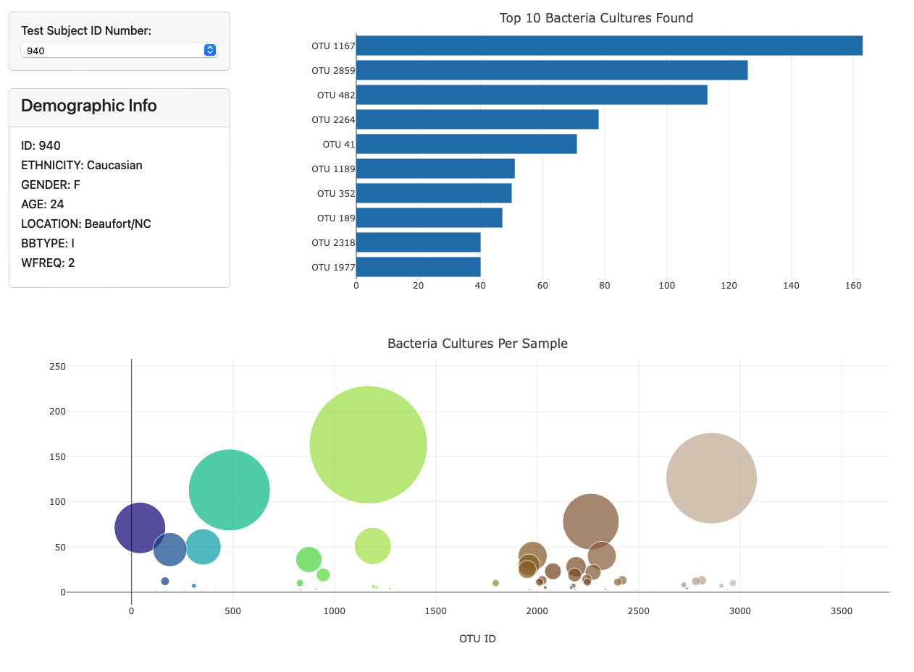

# belly-button-challenge

For this assignment, I built an interactive dashboard by reading a json file with Javascript. The dashboard contains a bar chart, bubble chart, and the ability to choose different samples.

https://andrew-m-vick.github.io/belly-button-challenge/Starter_Code/index.html
